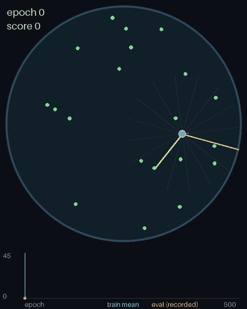

# CellSim

A single-cell organism with a tiny neural network brain learns to forage food in a petri dish, trained from scratch with PPO (PyTorch). Training records evaluation episodes you can replay per epoch in the browser.



*The same fixed-seed dish, replayed at ten points during one 500-epoch run (first 180 steps of each evaluation episode). The chart tracks mean training score (blue line) and single-episode evaluation scores (orange dots); the vertical line marks the epoch shown.*

## Setup
```bash
uv sync
```

## Train
```bash
uv run python -m cellsim.train                      # 500 epochs, 1024 parallel dishes, GPU if available
uv run python -m cellsim.train --epochs 100 --record-every 5
uv run python -m cellsim.train --resume runs/<id> --epochs 800
```
Ctrl+C finishes the current epoch, records it and saves a checkpoint.

## Watch
```bash
uv run python -m cellsim.serve                      # http://127.0.0.1:8000
```
Pick a run, drag the epoch slider or click the chart, and tick "Follow latest" to track a run in progress.

## Regenerate the animation
```bash
uv run python scripts/make_animation.py runs/<id> docs/training.gif
```

## Test
```bash
uv run pytest
```

Design: `docs/superpowers/specs/2026-10-03-cellsim-design.md`
